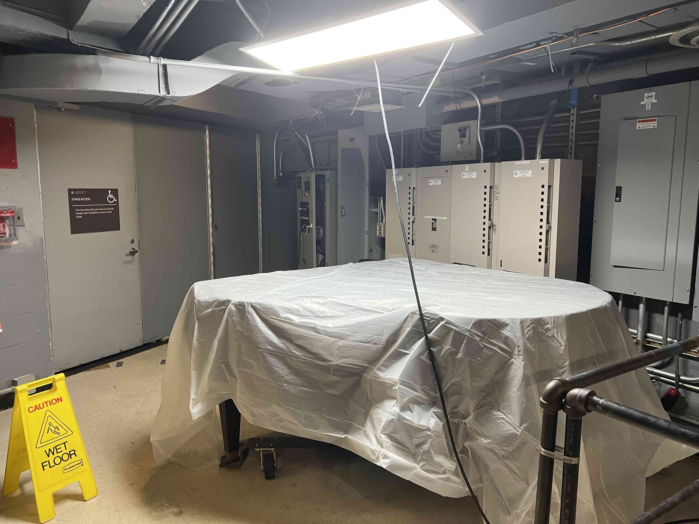

# This is Jeff's awesome website

Here's a gif of elmo


 
 You can add text
 
 * and lists
 * with extra bullets
 
 
 You can *Format* and **bold?**
 
 
This is a [link](https://google.com/) to a good data science tool. Here's a link to [P8105](https://p8105.com/). 

Here's a link to the [about](about.html) page.
 
 You can also use R!
 
```{r}
library(tidyverse)
plot_df = 
  tibble(
    x = runif(100),
    y = 1 + 2*x + rnorm(100)
  )

plot_df |> 
  ggplot(aes(x = x, y = y)) +
  geom_point()
```
 
 
 # Here's a new section
 
 My cat is ted. This is ted. 
 
 
 
 Also, here's the "backstage" are in Alumni Auditorium:
 
 